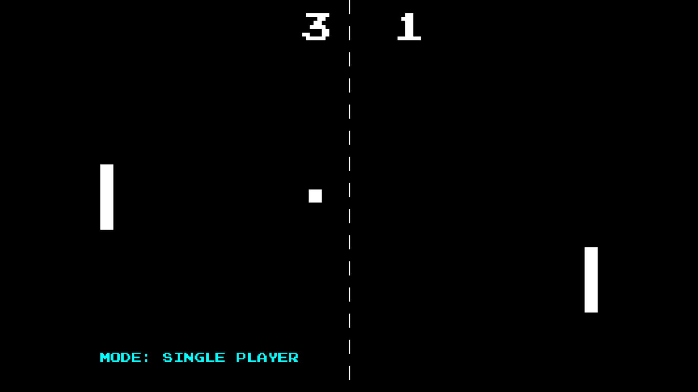

# Atari Pong Clone



This project is a faithful recreation of the classic Atari Pong game with modern enhancements. Implemented in both VB.NET (using vbPixelGameEngine created by [@DualBrain](https://github.com/DualBrain/)) and Python (using the Pygame module), this project offers a nostalgic gaming experience with additional features like single-player mode against AI, multiple game states, and a clean user interface.

## Features

- **Two Game Implementations**:
  - VB.NET version using VbPixelGameEngine
  - Python version using Pygame
- Single-player mode with intelligent AI opponent
- Two-player mode for competitive gameplay
- **Multiple game states**: Title screen, gameplay, pause, game over
- **Win condition**: First to 11 points with a 2-point lead
- AI difficulty configurable in source code
- Clean, retro-inspired visuals
- IME handling for seamless input in VB.NET version

## Prerequisites

### For VB.NET Version
- [.NET Framework](https://dotnet.microsoft.com/download) (4.8 or higher)
- [VbPixelGameEngine](https://github.com/DualBrain/vbPixelGameEngine) package, written by DualBrain

### For Python Version
- Python 3.7+
- Pygame library: `pip install pygame`

## How to Run

### VB.NET Version
1. Clone the repository:
   ```bash
   git clone https://github.com/Pac-Dessert1436/Atari-Pong-Clone-VBPGE-Python.git
   cd Atari-Pong-Clone-VBPGE-Python
   ```
2. Open the solution in Visual Studio
3. Build and run the project
4. Alternatively, run from command line:
   ```bash
   cd bin/Release
   AtariPong.exe
   ```

### Python Version
1. Clone the repository:
   ```bash
   git clone https://github.com/Pac-Dessert1436/Atari-Pong-Clone-VBPGE-Python.git
   cd Atari-Pong-Clone-VBPGE-Python
   ```
2. Install dependencies:
   ```bash
   pip install pygame
   ```
3. Run the game:
   ```bash
   python atari_pong.py
   ```

## Game Controls

| Action                 | Controls               |
|------------------------|------------------------|
| **Player 1 (Left)**    | W (up), S (down)       |
| **Player 2 (Right)**   | UP/DOWN arrows         |
| **Pause/Resume**       | P                      |
| **Return to Menu**     | ESC                    |
| **Start Game**         | SPACE (after selection)|
| **Select Game Mode**   | 1 (Single), 2 (Two)    |
| **Restart Game**       | SPACE (game over)      |

## Game Modes

### Single Player
- Play against a computer-controlled opponent
- AI adapts to ball trajectory with configurable difficulty
- Moderate challenge with error margin and reaction delay

### Two Players
- Play against a friend on the same machine
- Classic competitive Pong experience
- Perfect for local multiplayer sessions

## Game States

1. **Title Screen**: 
   - Game mode selection
   - Control instructions
   - Start prompt

2. **Gameplay**:
   - Real-time paddle movement
   - Physics-based ball mechanics
   - Score display

3. **Paused**:
   - Temporary game suspension
   - Resume or return to menu

4. **Game Over**:
   - Winner announcement
   - Option to restart or return to menu

## Technical Details

### VB.NET Implementation
- Uses VbPixelGameEngine for efficient rendering
- Implements Windows API for IME handling
- Object-oriented design with clear state management
- Physics calculations with velocity adjustments

### Python Implementation
- Built with Pygame for cross-platform compatibility
- Functional programming approach
- Real-time AI prediction algorithm
- Score tracking with win conditions

## Contributing

Contributions are welcome! Please follow these steps:
1. Fork the repository
2. Create a new branch (`git checkout -b feature/your-feature`)
3. Commit your changes (`git commit -am 'Add some feature'`)
4. Push to the branch (`git push origin feature/your-feature`)
5. Open a pull request

## License

This project is licensed under the MIT License - see the [LICENSE](LICENSE) file for details.

---

Enjoy the classic game of Pong with modern enhancements! Whether you choose the VB.NET or Python version, you're in for a nostalgic gaming experience with smooth controls and challenging gameplay.